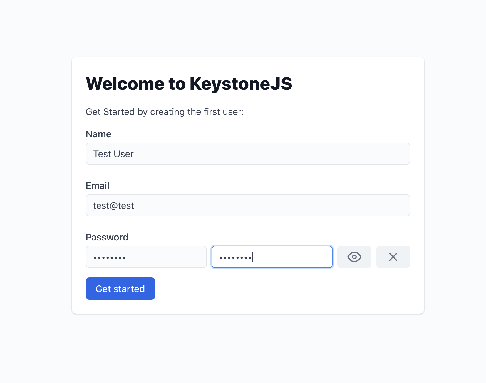
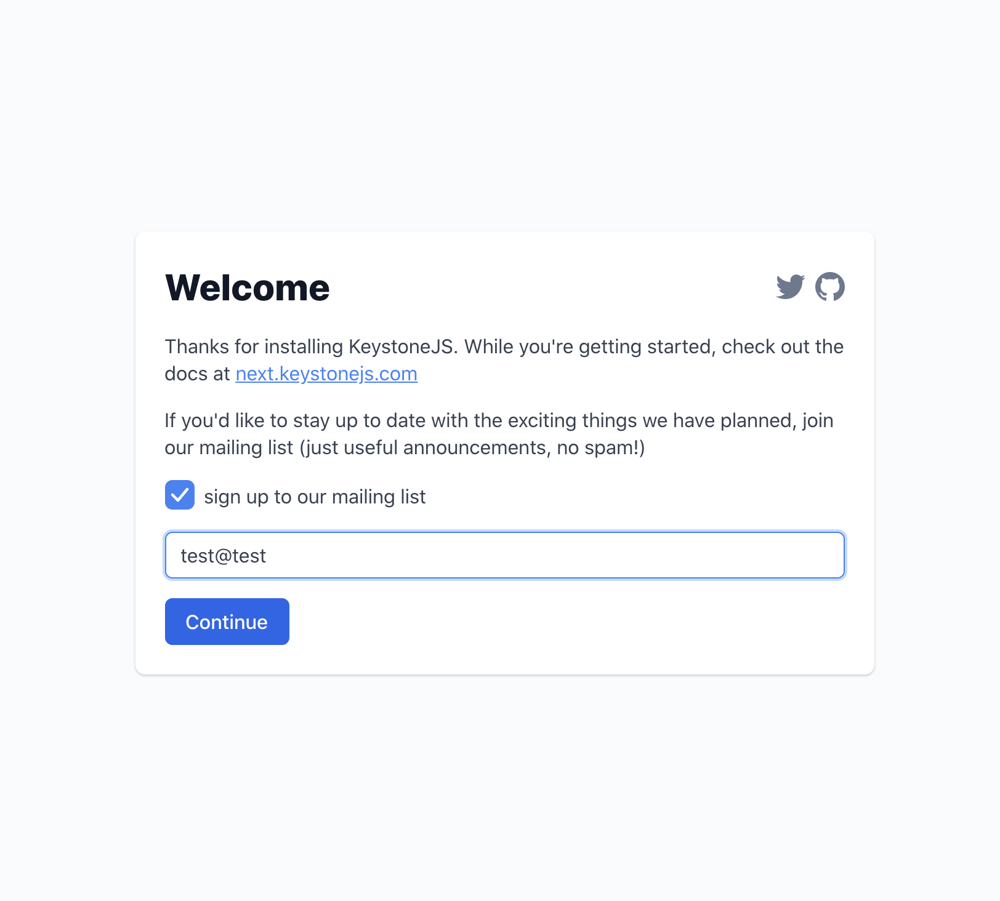

## Base Project - Authentication

This project is a base project which is used as a starter project for our other [feature examples](../).
It implements a basic task management system, with `Tasks` and `People` who can be assigned to tasks.

You can use this project as a starting place for learning how to use Keystone.

## Instructions

To run this project, clone the Keystone repository locally then navigate to this directory and run:

```shell
yarn dev
```

This will start the Admin UI at [localhost:3000](http://localhost:3000).
You can use the Admin UI to create items in your database.

You can also access a GraphQL Playground at [localhost:3000/api/graphql](http://localhost:3000/api/graphql), which allows you to directly run GraphQL queries and mutations.

🚀 Congratulations, you're now up and running with Keystone!

## Feature

This project shows off XYZ.

### Added fields

```typescript
      // Added an email and password pair to be used with authentication
      // The email address is going to be used as the identity field, so it's
      // important that we set both isRequired and isUnique
      email: text({ isRequired: true, isUnique: true }),
      // The password field stores a hash of the supplied password, and
      // we want to ensure that all people have a password set, so we use
      // the isRequired flag.
      password: password({ isRequired: true }),
```

### Auth config

```typescript
// createAuth configures signin functionality based on the config below. Note this only implements
// authentication, i.e signing in as an item using identity and secret fields in a list. Session
// management and access control are controlled independently in the main keystone config.
const { withAuth } = createAuth({
  // This is the list that contains items people can sign in as
  listKey: 'Person',
  // The identity field is typically a username or email address
  identityField: 'email',
  // The secret field must be a password type field
  secretField: 'password',

  // initFirstItem turns on the "First User" experience, which prompts you to create a new user
  // when there are no items in the list yet
  initFirstItem: {
    // These fields are collected in the "Create First User" form
    fields: ['name', 'email', 'password'],
  },
});
```

### Session

Can I do some magic github link to a block of code?

<insert file:range here>

https://github.com/keystonejs/keystone/blob/07c371f7b1335b321124dfb833b857c0934fefb5/examples/with-auth/keystone.ts#L6

https://github.com/keystonejs/keystone/blob/07c371f7b1335b321124dfb833b857c0934fefb5/examples/with-auth/keystone.ts#L6-L23

```typescript
// Stateless sessions will store the listKey and itemId of the signed-in user in a cookie.
// This session object will be made availble on the context object used in hooks, access-control,
// resolvers, etc.
const session = statelessSessions({
  // The session secret is used to encrypt cookie data (should be an environment variable)
  secret: '-- EXAMPLE COOKIE SECRET; CHANGE ME --',
});
```

### Wrapped config

```typescript
// We wrap our config using the withAuth function. This will inject all
// the extra config required to add support for authentication in our system.
export default withAuth(
  config({
    db: {
      provider: 'sqlite',
      url: process.env.DATABASE_URL || 'file:./keystone-example.db',
    },
    lists,
    // We add our session configuration to the system here.
    session,
  })
);
```

## Screenshots

### Admin UI

Screenshots of the first item experience, mailing list experience(?), login screen, the "logged in as" bit, logout button.




### GraphQL Playground

Show off the new API that this has added and how to use it

### Somehow show session cookie data.

## Next steps

This project is a bare bones system, and doesn't use any of Keystone's advanced features.
We encourage you to experiment with the code here to see how Keystone works, become familiar with the Admin UI, and learn about the GraphQL Playground.

Once you've got the hang of using this project, you can check out the [feature examples](../).
These projects build on this starter project and show you how to use Keystones advanced features to take your project to the next level.
